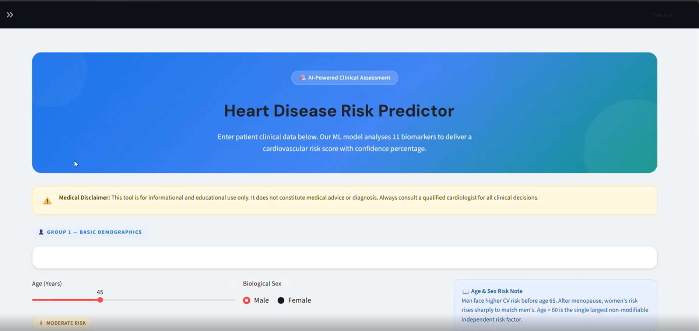
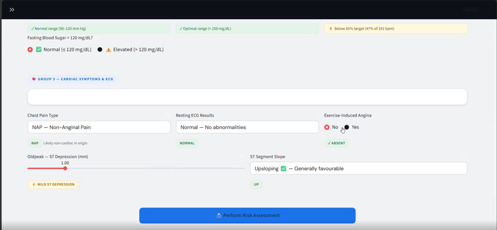
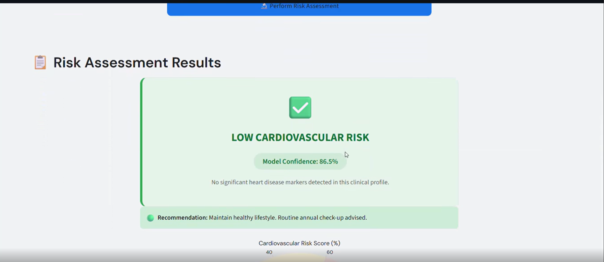
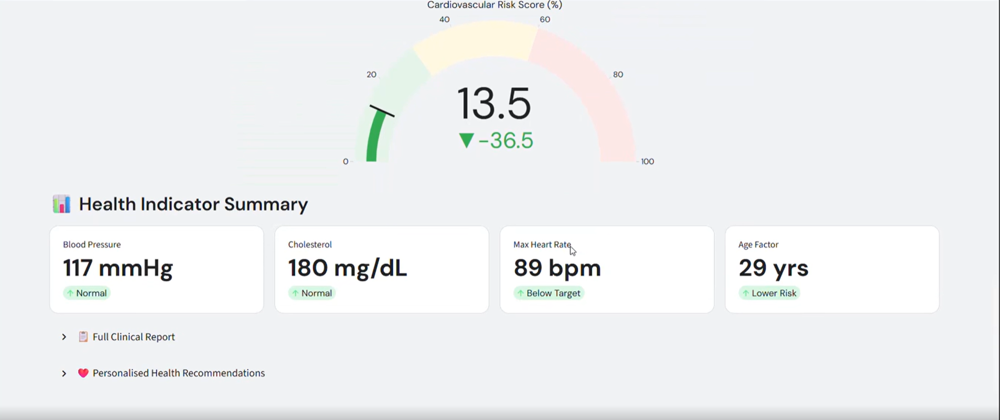
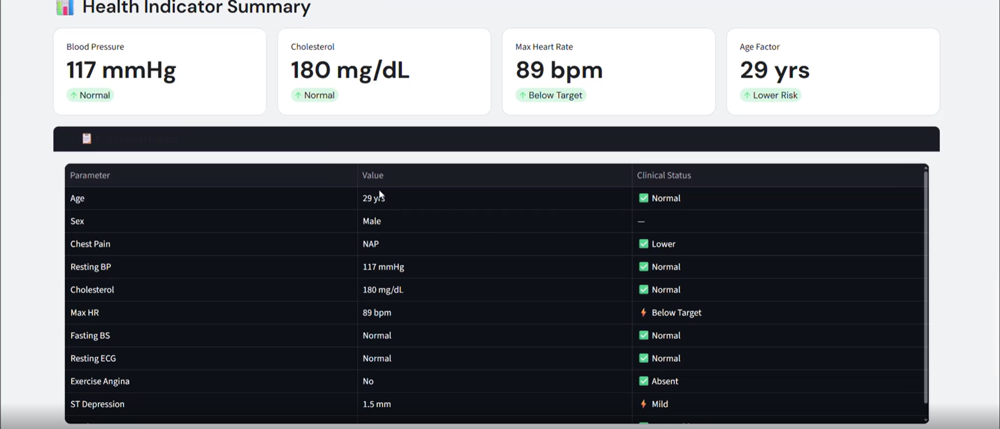

# 🫀 CardioCare AI — Heart Disease Risk Predictor

An interactive, ML-powered web application that estimates a patient's cardiovascular disease risk from 11 clinical biomarkers — built end-to-end from data preprocessing and model training to a production-style Streamlit dashboard.


**🎥 Demo Video:** [Watch on LinkedIn](https://lnkd.in/p/dBfFFkty)

---

## 📸 Screenshots

| Risk Predictor Form | Cardiac Symptoms & ECG Inputs |
|---|---|
|  |  |

| Risk Assessment Result | Risk Score Gauge & Health Summary |
|---|---|
|  |  |

**Full Clinical Report**


---

## 📋 Overview

CardioCare AI is a clinical decision-support tool that predicts the likelihood of heart disease using a **Logistic Regression** model trained on the UCI Heart Disease dataset. The app goes beyond a simple prediction form — it includes a full analytics dashboard, model transparency page, and session-based prediction history, all wrapped in a custom-designed clinical UI.

### Key Features
- 🔬 **Risk Prediction** — Enter patient vitals (age, sex, blood pressure, cholesterol, ECG results, etc.) and get an instant risk score with confidence percentage
- 📊 **Analytics Dashboard** — Interactive Plotly visualizations: risk distribution, age vs. max heart rate correlation, feature importance, and cholesterol/age distributions by risk group
- ℹ️ **Methodology & About Page** — Full transparency on model specs, dataset provenance, and feature definitions
- 📋 **Session History** — Tracks predictions made during the session in a live table
- 🎨 **Custom Clinical UI** — Material-inspired design system built with custom CSS on top of Streamlit

---

## 🧠 Model Details

| Parameter | Detail |
|---|---|
| Algorithm | Logistic Regression (L2 regularization) |
| Dataset | UCI Heart Disease Dataset — 918 patient records |
| Features | 11 clinical biomarkers |
| Train/Test Split | 67% / 33% |
| **Accuracy** | **~86%** |
| **F1 Score** | **~0.88** |
| Framework | Scikit-learn, Joblib |

The dataset merges five clinical sources: Cleveland Clinic Foundation, Hungarian Institute of Cardiology, University Hospitals (Zürich & Basel), Long Beach VA Medical Center, and the Statlog (Heart) dataset.

**Features used:** Age, Sex, Chest Pain Type, Resting Blood Pressure, Cholesterol, Fasting Blood Sugar, Resting ECG, Max Heart Rate, Exercise-Induced Angina, Oldpeak (ST depression), ST Slope.

Several algorithms were benchmarked during development (Logistic Regression, KNN, Naive Bayes, SVM, Decision Tree) — Logistic Regression was selected for its balance of accuracy and interpretability.

---

## 🛠️ Tech Stack

- **Frontend/App:** Streamlit
- **ML:** Scikit-learn, Joblib
- **Data Processing:** Pandas, NumPy
- **Visualization:** Plotly Express & Graph Objects
- **Model Development:** Jupyter Notebook (EDA, preprocessing, model comparison)

---

## 📂 Project Structure

```
├── app.py                      # Streamlit application
├── Heart_Dieseas_Project.ipynb # EDA, preprocessing & model training notebook
├── logistic_regression.pkl     # Trained model
├── scaler.pkl                  # Fitted StandardScaler
├── column.pkl                  # Feature column order used at inference
├── requirements.txt            # Python dependencies
└── README.md
```

---

## 🚀 Getting Started

### 1. Clone the repository
```bash
git clone https://github.com/<your-username>/CardioCare-AI-Heart-Disease-Predictor.git
cd CardioCare-AI-Heart-Disease-Predictor
```

### 2. Install dependencies
```bash
pip install -r requirements.txt
```

### 3. Run the app
```bash
streamlit run app.py
```

The app will open at `http://localhost:8501`.

---

## ⚠️ Disclaimer

This tool is built for **educational and portfolio purposes only**. It is **not a diagnostic medical device** and results are probabilistic, not clinical. The model is trained on a specific dataset with a measured ~14% error rate and should never be used as a substitute for professional medical advice. Always consult a qualified cardiologist for clinical decisions.

---

## 📈 Future Improvements

- [ ] Deploy to Streamlit Cloud / Hugging Face Spaces
- [ ] Add SHAP-based explainability for individual predictions
- [ ] Experiment with ensemble models (Random Forest, XGBoost) to improve recall
- [ ] Add persistent storage for prediction history (currently session-only)
- [ ] Add unit tests for preprocessing pipeline

---

## 👤 Author

**[Mohit Jadav]**
[LinkedIn](www.linkedin.com/in/mohit-jadav-) · [Portfolio](#) · [Email](jadavmohit2007@gmail.com)

---

## 📄 License

This project is licensed under the MIT License.
